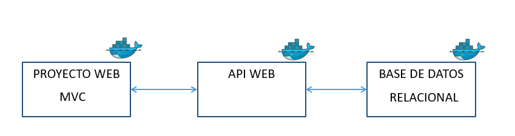

# Aplicación base INF-236  
En este repositorio encontrará un proyecto base que se basa en un CRUD (CREATE, READ, UPDATE, DELETE) sencillo de tareas.  
## Instalaciones necesarias  
* **Docker**: Docker es una plataforma de software que permite a los desarrolladores crear, empaquetar y desplegar aplicaciones en contenedores. Un contenedor es una unidad de software que contiene todo lo necesario para que una aplicación se ejecute, incluyendo el código, las dependencias y las configuraciones del sistema.  
[Link Docker](https://www.docker.com/)  
* **Node**: Es el entorno de ejecución de JavaScript que nos permitirá crear aplicaciones tanto en el lado del backend como en el frontend con JavaScript.  
[Link Node](https://nodejs.org/es/download) 
* **Git**: Es el sistema controlador de versiones más popular utilizado en la actualidad. Nos servirá para poder guardar nuestra aplicación y monitorear los cambios realizados.    
[Link Git](https://git-scm.com/downloads)
* **Postman**: Herramienta utilizada para probar, documentar y compartir API.
## Stack utilizado  
El Stack utilizado esta centrado en NodeJS junto con la base de datos relacional PostgreSQL.   
* Por un lado, estamos utilizando React vite (por temas de rendimiento) en el Front-end, además de las librerías de axios (para la conexión y las peticiones en el backend), y tailwind para el diseño de la aplicación.  
* En el caso de el Backend, se está utilizando el Framework de express, junto con el ORM Sequelize, para realizar las consultas directamente a la base de datos.      
## Estructura del Proyecto

## Documentación  
## Frontend
### [React](https://react.dev/)  
### [Tailwind](https://tailwindcss.com/)  
### [Axios](https://axios-http.com/docs/intro)    
## Backend  
### [Express](https://expressjs.com/es/guide/routing.html)  
### [Sequelize](https://sequelize.org/)    

# Como levantar el proyecto 
Una vez instalado Docker, deberan iniciarlo y abrir una terminal en la ruta donde se encuentra su proyecto, y escribir el siguiente comando:  
```docker
docker compose up
```  
Este comando nos servirá para crear las imagenes y contendores del backend y frontend del proyecto.


# Docker    
A continuación se presentan algunos comandos de utilidad de docker:  
- Descargar una imágen:  
    ```docker  
    docker pull <nombre de la imagen>:<tag de la versión>  
    #Ejemplo  
    docker pull postgres:latest  
    ```  
    Existe la plataforma [Docker Hub](https://hub.docker.com/), la cuál cuenta con una gran cantidad de imágenes para poder utilizar.  
- Para poder listar nuestras imágenes:  
    ```docker  
    docker images  
    ```
- Para poder eliminar una imagen:  
    ```docker
    docker rmi <id de la imagen| nombre de la imagen>
    ```  
- Para crear un contenedor basado en una imágen:  
    ```docker
    docker create --name <nombre que le asignaremos al contenedor> <nombre de la imagen>  
    #Ejemplo  
    docker create --name DB-analisis postgres
    ```    
    Esto nos devolverá el id de el contenedo y nos debería crear un contenedor llamado ``DB-analisis`` con la imagen de ``postgres``
- Para poder listar las imágenes que están corriendo, utilizamos el comando ``ps`` de docker:  
    ```bash
    docker ps  
    ```      
- Para poder listar ``"TODAS LAS IMAGENES"``:
    ```docker    
    docker ps -a
    ```  
- Para poder iniciar un contenedor, utilizamos:  
    ``` docker  
    docker start <nombre contenedor / id_contenedor>
    #Ejemplo  
    docker start fe_container  
    o  
    docker start ec35sfe343
    ```  
- Para poder detener un contenedor, utilizamos:  
    ```docker  
    docker stop <nombre contenedor / id contenedor>
    #Ejemplo  
    docker stop fe_container  
    o  
    docker stop ec35sfe343
    ```
- Para eliminar un contenedor, utilizamos el siguiente comoando:  
    ```docker  
    docker rm <nombre contenedor / id contenedor>  
    #Ejemplo  
    docker rm fe_container  
    o  
    docker rm ec35sfe343
    ```  
Para más información visite el [sitio oficial de Docker](https://docs.docker.com/get-started/).


